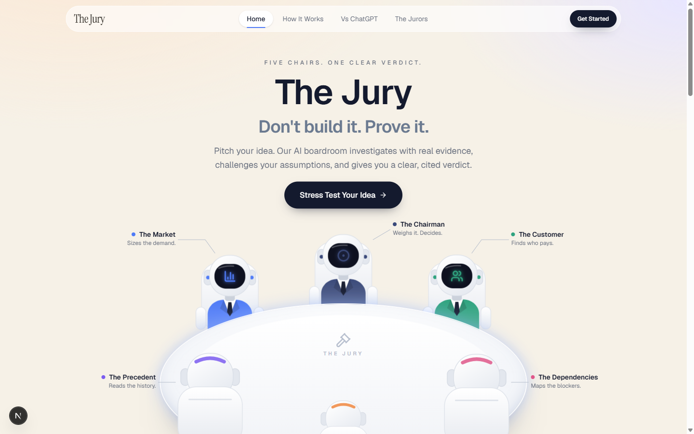
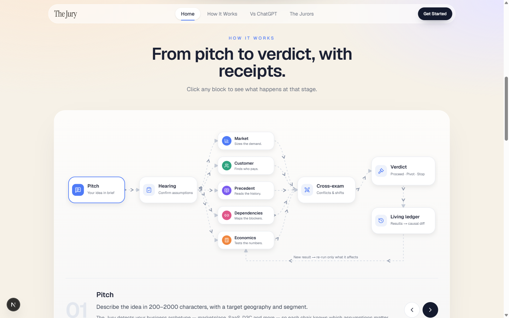
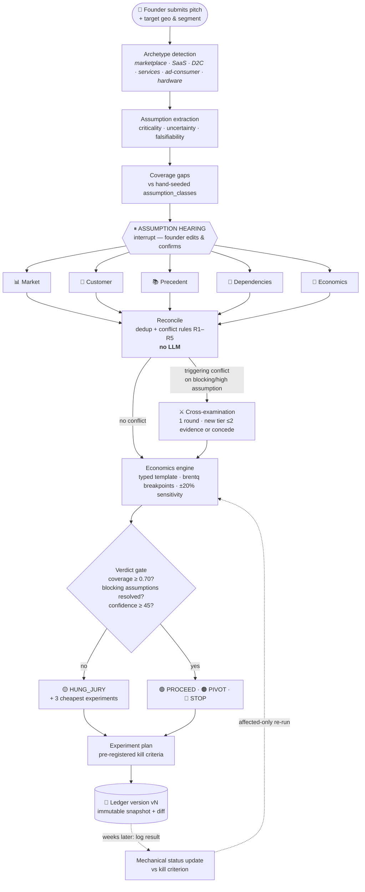
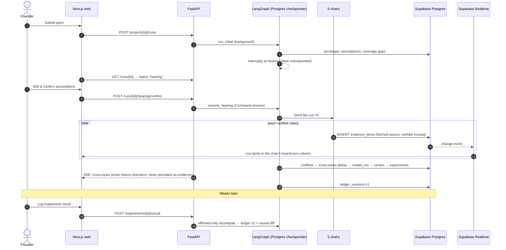
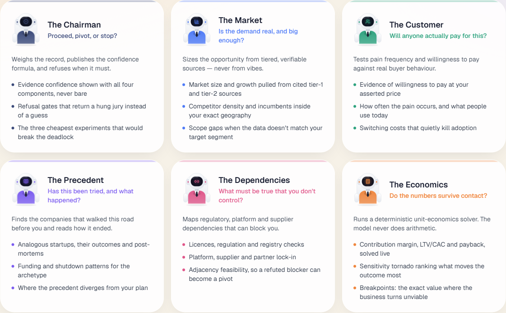
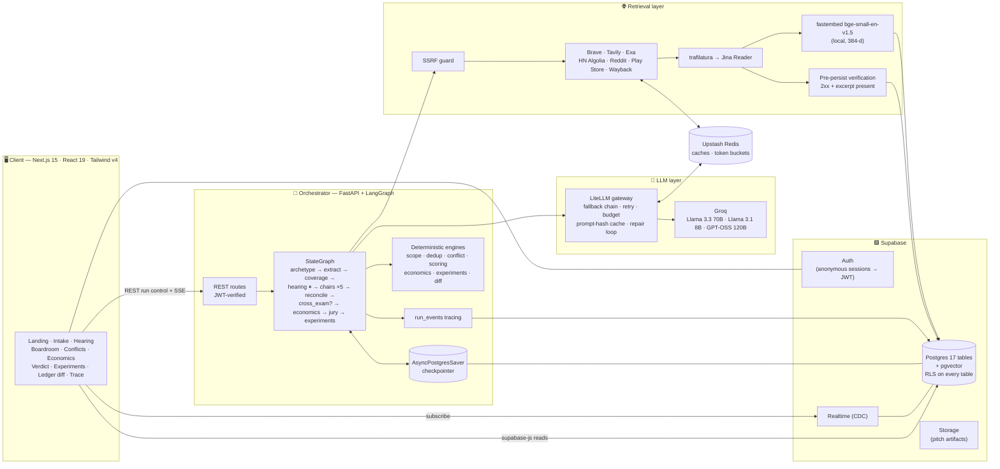
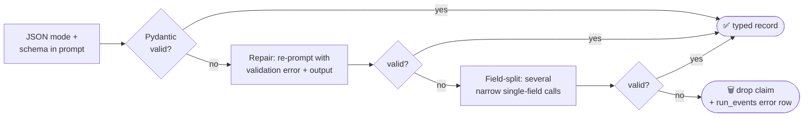
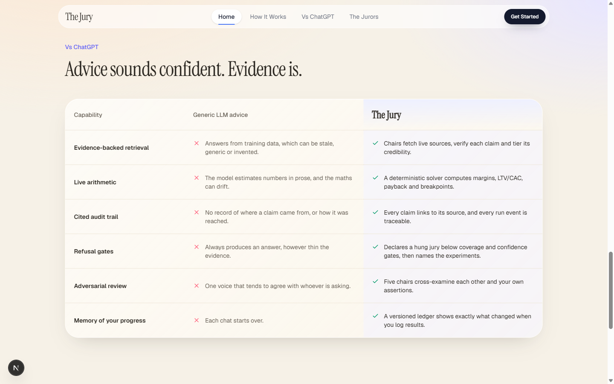
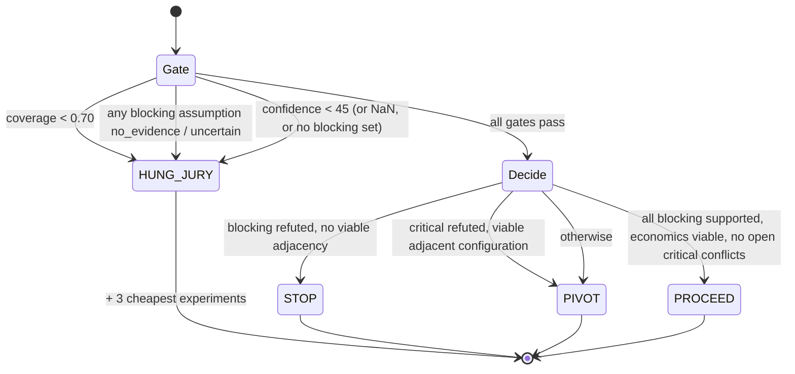
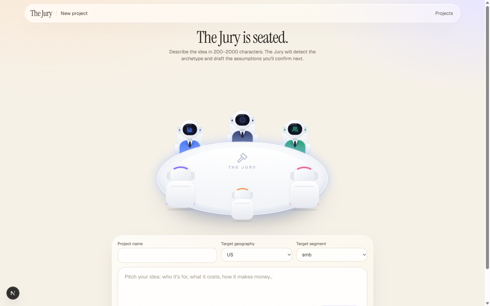

<div align="center">

# ⚖️ The Jury

### Don't build it. Prove it.

**An evidence-led startup validation system.** Five specialist AI investigators build a cited, versioned record of the beliefs your idea depends on. A deterministic jury rules on that record, and it is allowed to refuse to rule.

[](LICENSE)


[The problem](#-the-problem) · [Core idea](#-the-core-idea-in-one-example) · [How it works](#%EF%B8%8F-how-it-works) · [Architecture](#%EF%B8%8F-system-architecture) · [AI usage](#-how-ai-is-used-and-where-it-is-deliberately-not) · [Tech stack](#-tech-stack) · [Bring your own key](#-bring-your-own-key) · [Getting started](#-getting-started) · [Honest limits](#-honest-limits)

<br/>



</div>

---

## 🔥 The problem

> **Founders do not fail because nobody warned them. They fail because nobody checked.**

Every early-stage idea rests on a handful of **load-bearing beliefs**:

- a specific customer has this pain
- they will pay more than it costs to deliver
- the channel to reach them is affordable
- the thing is legal and technically possible
- the space is not already a graveyard

These beliefs are rarely written down. They are rarely separated from what the founder actually *knows*. Almost none get tested before months of build time are spent. And every option a founder has today gives **opinion where evidence is needed**:

| Option | How it fails |
|---|---|
| Friends and peers | Politeness bias. They agree. |
| Generic chatbots | Sycophantic, averaged-out advice. No sources, no real arithmetic, and nothing you can check. |
| "AI advisor panel" tools | Five system prompts on one model. Same training data and same blind spots, so the panel agrees with itself instead of arguing. |
| Manual desk research | Correct but slow, unstructured, not reusable, and usually dropped after a week. |
| Accelerator feedback | High quality, but gated, late, and not continuous. |

The need is not *more advice*. It is a **checkable record**: every belief the business depends on, what real-world evidence says about it, where that evidence came from, what is still unknown, and the cheapest test that would settle each unknown.

---

## ✅ What The Jury solves

The Jury is a **virtual courtroom for an idea**.

1. **You pitch.** Plain language, plus a target geography and segment.
2. **The Assumption Hearing.** The pitch is broken into single, falsifiable assumptions. Each is scored for criticality, uncertainty and falsifiability, and checked against a **hand-seeded checklist** for your business archetype, so the things your pitch *never mentions* are flagged as gaps. Nothing is investigated until you confirm the list.
3. **Five investigators run in parallel.** Each chair gathers source-backed evidence from a *different corpus*. Every claim must cite a URL that was actually fetched, and the quoted excerpt must appear on that page, or the claim is rejected before it reaches the database.
4. **A deterministic conflict engine** finds real contradictions. The most important kind is *your pitch versus the world*.
5. **Targeted cross-examination** runs only where a real conflict exists. The chairs involved must bring better evidence or concede.
6. **An economics engine** runs a typed unit-economics model and solves for the exact **breakpoints** where the business stops working.
7. **The Jury rules** `PROCEED`, `PIVOT` or `STOP`, or declares a **`HUNG_JURY`** when the evidence is too thin, and names the three cheapest experiments that would break the deadlock.
8. **The living ledger.** You come back weeks later with real results. The ledger re-runs only what those results affect, writes an immutable new version, and shows a **one-sentence causal diff** instead of a new report.

> **The one-line differentiator:** every number The Jury produces traces back to either a fetched URL or an executed arithmetic model.

### Who it is for

| Persona | Use |
|---|---|
| **Pre-commitment builder** (primary) | A solo founder or small team one to six weeks from committing real time or money. *"Before I spend three months on this, tell me what has to be true, what's already known, and what to go find out first."* |
| Student / hackathon team | Validate before building; produce a defensible case file. |
| Accelerator applicant | Turn a pitch into an evidence-backed narrative before diligence. |
| Intrapreneur / product lead | Justify or kill an internal proposal with a record, not a deck. |
| Angel / micro-VC | A fast, structured first pass on inbound pitches. |

**Not for:** anyone looking for encouragement. The Jury is built to be uncomfortable.

---

## 💡 The core idea in one example

A founder pitches a subscription product for Indian SMBs at **₹499/month**.

```text
HEARING      "SMBs will pay ₹499/month"   → criticality: blocking · uncertainty: unknown
             Coverage gap: the pitch never mentions retention or channel cost.

MARKET       Tier-1 pricing page (fetched, excerpt verified):
             closest comparable charges ₹149/month for the same segment and geography.

CONFLICT R3  Founder asserted ₹499 vs evidence ₹149 → 235% divergence (> 25% threshold)
             → founder_vs_world → cross-examination fires automatically.

ECONOMICS    brentq solve: "the business becomes loss-making above ₹38 delivery cost."
             Sensitivity ranks price_monthly #1, and it is still founder_asserted.

EXPERIMENT   #1 → presale fake-door · kill criterion pre-registered: ≥ 4 of 20 prepay.

── three weeks later: founder logs 3/20 prepaid ──

LEDGER v2    pricing_wtp moved uncertain → refuted, which moved price_monthly from
             founder_asserted ₹499 to evidence_backed ₹249, which moved the break-even
             delivery cost from ₹38 to ₹19. Verdict changed PROCEED → PIVOT.
```

No model gave an opinion. A URL, a rule, a solver and a pre-registered threshold produced that sentence.

---

## 🎯 Why we built this

We had watched good builders spend months on ideas whose fatal flaw was **findable in an afternoon**: a competitor charging a third of the price, a licence nobody mentioned, a company that tried the same model in 2019 and whose website is now a Wayback snapshot.

When we asked LLMs to "validate a startup idea", we kept getting the same thing back: confident, fluent, **unfalsifiable** prose. The numbers were made up. There were no sources. It never said *"I don't know."* The "AI panel of advisors" tools were worse, because they dressed one model up as five people and called the agreement consensus.

So we set ourselves one constraint: **build a validator whose every output a sceptic can check.** That single rule shaped every decision in this repository:

- Evidence without a fetched source can't be inserted, and the database rejects it.
- Arithmetic is done by `numpy`/`scipy`, never by a language model.
- Conflict detection is plain rules, not a model judgement.
- The scoring formulas are [published](docs/SCORING.md) so you can argue with the weights.
- The system is allowed, and in fact *required*, to refuse to rule when it doesn't know.

---

## ⚙️ How it works

<div align="center">

<br/><sub><i>The pipeline as shown in the product's landing page.</i></sub>
</div>

### End-to-end flow



### What a single run looks like over time



---

## 🪑 Meet the jurors

The chairs are specialised by **evidence source and retrieval method, not by personality**. Five personas on one model share blind spots and agree with each other. Five different corpora don't.

<div align="center">

</div>

| Seat | Question it answers | Providers (routed in `retrieval/budgets.py`) | Query budget / run | What it emits |
|---|---|---|---|---|
| 📊 **Market** | Is the demand real, and big enough? | Brave, Tavily | 8 | Price/plan claims, competitor counts, funding facts |
| 👥 **Customer** | Will anyone actually pay for this? | HN Algolia (keyless), Reddit, Play Store, Brave | 8 | Pain language, willingness-to-pay and refusal evidence |
| 📚 **Precedent** | Has this been tried, and what happened? | Exa, Brave, **Wayback CDX** death verification | 10 | Named companies with outcome, cause, date and a verifiable source |
| 🔗 **Dependencies** | What must be true that you don't control? | Brave + direct doc/registry fetches | 6 | A *named* external dependency with a *citable* property (price, rate cap, licence, lead time) |
| 🧮 **Economics** | Do the numbers survive contact? | Brave (benchmark lookups only) + `numpy`/`scipy` | 3 | Breakpoints, sensitivity ranking, viability |
| ⚖️ **Chairman / Jury** | Proceed, pivot, or stop? | *None. It never investigates.* | — | Evidence Confidence, verdict or refusal, friction summary |

Every chair emits only **typed claim records** (`ClaimRecord`), not free prose:

```json
{
  "assumption_id": "uuid",
  "direction": "refutes",
  "variable": "price_monthly",
  "value_num": 149.0,
  "unit": "INR_per_month",
  "scope": { "geo": "IN", "segment": "smb", "tier": "entry", "period": "2026" },
  "confidence": 0.8,
  "source_url": "https://…/pricing",
  "source_tier": 1,
  "excerpt": "verbatim supporting text, ≤ 240 chars",
  "chair": "market"
}
```

---

## 🏗️ System architecture



### Key architectural decisions

| Decision | Chosen | Rejected | Why |
|---|---|---|---|
| Orchestration | **LangGraph + Postgres checkpointer** | Temporal, Celery, a request handler | A run lasts minutes, fans out five ways, branches conditionally, and pauses for human input. It has to be a durable state machine that survives an instance dying mid-run. |
| Streaming | **Supabase Realtime on ledger rows** | SSE for everything, Pusher | Survives reloads and multi-week gaps, and makes "a chair speaks only by writing a row" a *structural* fact. SSE is kept only for transient cross-exam prose. |
| Economics | **Typed templates + trusted solver** | LLM writes Python → sandbox | Reproducible, diffable results, provenance on every parameter, and no untrusted code execution at all. |
| Database | **Supabase Postgres** | CockroachDB, Neon, MongoDB | The ledger is a foreign-key graph with immutability and versioning. Supabase bundles Auth, Realtime and Storage. |
| Embeddings | **Local fastembed** | Hosted embedding API | The highest-volume call in the system. Running it locally removes a whole class of rate-limit and network failures, and Groq doesn't serve embeddings anyway. |
| Tracing | **In-app `run_events` table** | Langfuse / LangSmith | One table instead of another service, and the trace is visible inside the product. |
| Offline mode | **Protocol-based transports with fixture implementations** | Mocks scattered through tests | `JURY_OFFLINE=1` runs the whole pipeline with no credentials. Fixtures replace *transport* (HTTP bodies), never *logic* (verdicts, scores). |

---

## 🤖 How AI is used, and where it is deliberately not

> The most important engineering choice in The Jury is **where AI is not used.**

### Where the LLM works

All calls go through a single **LiteLLM gateway** to **Groq**, with model roles resolved from one config map (`jury/llm/models.py`):

| Task | Model role | Default model |
|---|---|---|
| Assumption extraction & 3-axis classification | `reasoning` | `llama-3.3-70b-versatile` |
| Cross-examination | `reasoning` | `llama-3.3-70b-versatile` |
| Jury rationale *prose* (the verdict itself is computed) | `reasoning` | `llama-3.3-70b-versatile` |
| Archetype detection | `fast` | `llama-3.1-8b-instant` |
| Claim structuring from fetched page text (highest call volume) | `fast` | `llama-3.1-8b-instant` |
| Scope typing | `fast` | `llama-3.1-8b-instant` |
| Experiment instructions | `fast` | `llama-3.1-8b-instant` |
| Fallback tier | `fallback` | `openai/gpt-oss-120b` |

Fallback chain: `reasoning → fast → fallback`. Quota errors advance a tier right away; transient errors retry once at the preferred tier.

### Making open-weight models reliable: the five-stage repair loop

Open-weight models are weaker at strict structured output than frontier models, so every structured call passes through `jury/llm/structured.py`:



*A dropped claim is fine. A malformed ledger row is not.*

### Where the LLM is never trusted

| Concern | Handled by | LLM involvement |
|---|---|---|
| Whether a source exists | HTTP fetch must return 2xx | **None** |
| Whether a quote is real | Excerpt must appear verbatim in the extracted page text (paraphrase rejected) | **None** |
| Source credibility tier | Rule-based domain map (`retrieval/tiers.py`); the model's claimed tier is overridden | **None** |
| Deduplication | `sha256(canonical_url ‖ variable ‖ scope)` unique constraint | **None** |
| Conflict detection | Rules R1–R5 (`engines/conflict.py`) | **None** |
| All arithmetic | `numpy` + `scipy.optimize.brentq` | **None** |
| Evidence strength & confidence | Published formulas (`engines/scoring.py`) | **None** |
| The verdict | Gate + decision table | **None** (the model only writes the explanation) |
| Coverage denominator | 45 hand-seeded assumption classes | **None**, and never generated at runtime |
| Kill-criterion evaluation | Machine-evaluable `criterion_spec` | **None** |

An import-boundary test (`tests/engines/test_purity.py`) fails the build if any deterministic engine imports the LLM, network or database layers.

---

## 🆚 How it differs from ChatGPT, Claude and other LLMs

General-purpose assistants like ChatGPT, Claude and Gemini are excellent at reasoning, writing and brainstorming. The Jury isn't trying to be a better chatbot. It is a **different kind of system**: an evidence pipeline that happens to use an LLM for a few narrow language tasks.

<div align="center">

</div>

| Dimension | General-purpose LLM chat | The Jury |
|---|---|---|
| **Where facts come from** | Training data, plus optional browsing, blended into prose | Only live, fetched sources; each claim is verified against the page before insert |
| **Citations** | Optional, sometimes wrong, not machine-checked | Mandatory; a claim without a fetched 2xx source and a verbatim excerpt **cannot** be inserted, and the database enforces it |
| **Numbers** | Estimated in text; arithmetic can drift | Computed by a deterministic solver; every parameter is tagged `evidence_backed` or `founder_asserted` |
| **Disagreement** | One voice, prone to agreeing with the user | Five corpora, rule-based conflict detection, and your own pitch treated as claims that can lose |
| **Saying "I don't know"** | Almost always produces an answer | A verdict gate makes `PROCEED`/`STOP` **structurally unreachable** on thin evidence → `HUNG_JURY` |
| **Reproducibility** | Different answer each time | Same evidence produces the same score, conflicts, breakpoints and verdict |
| **Transparency of judgement** | Opaque | Formulas and weights published in [`docs/SCORING.md`](docs/SCORING.md); confidence always shown with its four components |
| **Memory** | A conversation | An append-only, versioned ledger with a causal diff between versions |
| **Next step** | Generic suggestions | Experiments ranked by sensitivity × uncertainty, each with a **pre-registered kill criterion** |
| **Audit trail** | None | Every node, LLM call, fetch, latency and token count in `run_events`, viewable in-app |

---

## 📐 Scoring and the verdict gate

Full formulas are in **[`docs/SCORING.md`](docs/SCORING.md)**, kept in lockstep with the code.

**Source tiers:** Tier 1 primary artifact `1.00` · Tier 2 structured third-party `0.80` · Tier 3 journalism/blogs `0.55` · Tier 4 forums `0.30` (`0.15` for willingness-to-pay variables) · Tier 5 model prior: **not evidence, can't be stored**.

```text
raw_signal = Σ tier_weight(i) × confidence(i) × sign(i)
strength   = tanh(|raw_signal| / 2)

EvidenceConfidence = 100 × ( 0.30·coverage
                           + 0.30·mean_strength
                           + 0.20·(1 − contradiction)
                           + 0.20·(1 − open_critical) )
```

> The 0.30 / 0.30 / 0.20 / 0.20 split was **chosen by judgement, not fitted to data**, and it is published so you can argue with it.



The gate's unreachability claim is **brute-force tested over 504 input combinations**. A `STOP` on thin evidence is exactly as irresponsible as a `PROCEED` on thin evidence.

### Conflict rules

| Rule | Trigger | Kind | Cross-exam |
|---|---|---|---|
| **R1** | Tier ≤ 2 items with opposing directions, overlapping scope | chair vs chair | if blocking/high |
| **R2** | Same variable, overlapping scope, values diverge beyond ±10% | chair vs chair | if blocking/high |
| **R3** | Founder-asserted value diverges from evidence by > 25% | **founder vs world** | **always** |
| **R4** | Critical assumption has zero evidence | no evidence | never (feeds the gate) |
| **R5** | Evidence exists, but none covers the target scope | scope gap | never |

---

## 🧰 Tech stack

### Backend: orchestration, intelligence and engines

| Technology | Role in The Jury |
|---|---|
| **Python 3.12** | Backend runtime (pinned: `onnxruntime` has no 3.14 wheels and `fastembed` depends on it) |
| **uv** | Dependency management and lockfile |
| **FastAPI** + **Uvicorn** | REST API for project/run control, result logging, versions, export, and SSE for cross-exam prose |
| **LangGraph** | The durable pipeline: `Send` fan-out to five chairs, conditional cross-exam edge, `interrupt()` at the hearing |
| **langgraph-checkpoint-postgres** | Stores graph state in Postgres so a paused or crashed run resumes from its last completed node |
| **Pydantic v2** / **pydantic-settings** | Typed contracts (`ClaimRecord`, `Scope`, `CriterionSpec`…), LLM output validation, env config |
| **LiteLLM** | Single LLM gateway: model fallback chain, retries, budget caps, JSON mode |
| **Groq** | LLM inference (Llama 3.3 70B, Llama 3.1 8B instant, GPT-OSS 120B) |
| **psycopg 3** (+ pool) / **SQLAlchemy** | Async Postgres access and repositories (insert-only evidence repo) |
| **httpx** + **tenacity** | Outbound HTTP for search and fetch, with retry/backoff |
| **trafilatura** → **Jina Reader** | Tiered page-text extraction |
| **fastembed** (`bge-small-en-v1.5`) | Local 384-d embeddings of source chunks into pgvector; no API key |
| **NumPy** + **SciPy** (`brentq`) | Unit-economics templates, breakpoint root-finding, ±20% elasticity sensitivity |
| **python-jose** | Supabase JWT / JWKS verification on every route |
| **google-play-scraper** | Play Store listings and reviews for the Customer chair |
| **python-multipart** | Streamed, size-checked pitch artifact uploads |

### Retrieval providers

| Provider | Used by | Purpose |
|---|---|---|
| **Brave Search** | Market, Customer, Precedent, Dependencies, Economics | Independent web index |
| **Tavily** | Market | Agentic search |
| **Exa** | Precedent | Semantic find-similar companies |
| **HN Algolia** | Customer | Keyless, unlimited community signal |
| **Reddit** | Customer | Pain and willingness-to-pay language |
| **Wayback CDX** | Precedent | Keyless *death verification*: turns "seems gone" into a citable snapshot date |

### Data, realtime and infrastructure

| Technology | Role in The Jury |
|---|---|
| **Supabase Postgres** | The Evidence Ledger: 17 tables, CHECK constraints, 11 migrations |
| **pgvector** | Source-chunk embeddings in the same transaction as the evidence they support |
| **Row-Level Security** | Enabled on every table; user-owned data is scoped to `auth.uid()` |
| **Supabase Realtime** | Streams `evidence_items` inserts into the live boardroom |
| **Supabase Auth** | Anonymous sessions issuing the JWT that FastAPI and RLS key on |
| **Supabase Storage** | Pitch artifacts (decks, etc.) |
| **Upstash Redis** | Search/fetch/LLM response caches, per-chair token buckets, node idempotency, web rate limiting |
| **Docker** + **Supabase CLI** | Local stack |

### Frontend

| Technology | Role in The Jury |
|---|---|
| **Next.js 15** (App Router) | Web app: landing, intake, hearing, boardroom, results, ledger, trace viewer |
| **React 19** | UI runtime |
| **TypeScript 5** | Typed API and ledger models (`lib/types.ts`) |
| **Tailwind CSS v4** | Styling |
| **shadcn/ui-style primitives** + **class-variance-authority**, **clsx**, **tailwind-merge** | Component system |
| **lucide-react** | Icons |
| **@supabase/ssr** / **supabase-js** | Session middleware, RLS-scoped direct reads, Realtime subscriptions |
| **@upstash/ratelimit** | Request rate limiting |

### Quality and tooling

| Technology | Role |
|---|---|
| **pytest** + **pytest-asyncio** + **respx** | Backend unit, integration and graph tests with HTTP mocking |
| **Ruff** | Python linting |
| **Vitest** + **Testing Library** + **jsdom** | Frontend component tests |
| **Playwright** | End-to-end boardroom spec |
| **ESLint** | Frontend linting |

---

## 🧱 Product principles, enforced in code

These are **constraints**, not prompt instructions. Each maps to a database constraint, a code path or a test.

| # | Principle | Enforcement |
|---|---|---|
| P1 | **No source, no entry** | Pre-persist fetch verification + `CHECK http_status between 200 and 299` |
| P2 | **Claims and evidence are different things** | Separate tables; `discovered_by_matches_origin` CHECK |
| P3 | **The ledger is the single source of truth** | The UI renders only persisted rows over Realtime; there is no narration path |
| P4 | **Coverage is measured against an external denominator** | 45 hand-seeded `assumption_classes`, never LLM-generated |
| P5 | **The Jury may refuse to rule** | Verdict gate; brute-force unreachability test |
| P6 | **Evidence is immutable** | `UPDATE`/`TRUNCATE` revoked from every role plus triggers; corrections supersede |
| P7 | **Debate only where conflict exists** | Conditional LangGraph edge on deterministic rules |
| P8 | **Economics is computed, not described** | Typed templates + trusted solver; engine purity test |
| P9 | **Every experiment has a pre-registered kill criterion** | Export is blocked unless every criterion is non-null and evaluable |
| P10 | **Corroboration must be independent** | `unique (project_id, dedup_hash)` |

---

## 🔐 Security and data integrity

- **SSRF guard for model-selected URLs:** blocks private ranges, loopback in dotted-octal/hex/shorthand forms, cloud metadata endpoints, trailing-dot host bypasses and IDN homoglyphs. Redirect targets are re-checked hop by hop.
- **Fetched content is data, never instructions.** Nothing on a fetched page is ever run as a directive.
- **Database-enforced immutability:** evidence can't be `UPDATE`d or `TRUNCATE`d by any role, superuser included. Project and account **erasure** still works through cascades, so immutability protects against falsifying history without blocking the right to delete.
- **Immutable ledger versions:** `ledger_versions` rows can't be rewritten.
- **RLS on all tables**, with API-boundary ownership checks before any background run is dispatched.
- **JWT verified** on every orchestrator route (JWKS).
- **Streamed upload size checks**, so a hostile upload is never buffered whole.
- **No secrets in the repo:** `.env.example` lists key names only.

---

## 🗂️ Repository structure

```text
Jury/
├── apps/
│   ├── api/                        # FastAPI + LangGraph orchestrator (Python 3.12, uv)
│   │   ├── jury/
│   │   │   ├── api/                # routers: projects, runs, stream, experiments, versions, export, health
│   │   │   ├── graph/              # StateGraph build, edges, nodes, rerun, idempotency
│   │   │   ├── chairs/             # market, customer, precedent, dependencies, economics
│   │   │   ├── engines/            # scope, dedup, scoring, conflict, economics/, experiments, criterion, diff, affected
│   │   │   ├── retrieval/          # ssrf, tiers, search, budgets, fetch, extract, verify, embed
│   │   │   ├── llm/                # gateway, models, cache, structured (repair loop), prompts
│   │   │   ├── schemas/            # Pydantic contracts
│   │   │   ├── transport/          # Live vs Fixture transports (offline mode)
│   │   │   ├── tracing/            # run_events sink + @traced
│   │   │   └── db/                 # pool, repositories, ledger snapshot
│   │   ├── tests/                  # 680+ test functions + recorded fixtures
│   │   └── evals/fixtures/         # 100-URL tier-assignment eval
│   └── web/                        # Next.js 15 app
│       ├── app/                    # routes: /, /projects, /projects/new, /projects/[id], /projects/[id]/trace
│       ├── components/             # boardroom, hearing, conflicts, economics, verdict, experiments, ledger, trace, landing
│       ├── hooks/                  # Realtime evidence stream, cross-exam SSE, results data
│       ├── lib/                    # API client, Supabase clients, chair metadata, types
│       ├── tests/                  # Vitest component tests
│       └── e2e/                    # Playwright spec
├── supabase/migrations/            # 0001–0011: schema, RLS, immutability, cascades
├── db/seed/                        # 45 assumption classes, 33 domain→tier rules
├── docs/
│   ├── PRD.md                      # product requirements (the authority)
│   ├── SCORING.md                  # every formula and weight, published
│   ├── superpowers/                # design spec + phase-by-phase implementation plans
│   └── assets/screenshots/         # README images
├── CHANGELOG.md                    # what was actually built, gate outputs, deviations
├── .env.example
└── LICENSE
```

---

## 🔑 Bring your own key

> **The Jury ships with no API keys. You bring your own.**

Every LLM call and every search runs on **your** accounts, under **your** quotas and billing. Nothing is proxied through a shared key, and keys never leave your environment: they are read from `apps/api/.env` on your machine or server, are gitignored, and are never sent to the browser.

| Key | Get it from | Needed for | Free tier |
|---|---|---|---|
| `GROQ_API_KEY` | [console.groq.com](https://console.groq.com/keys) | All LLM calls | Yes |
| `BRAVE_API_KEY` | [brave.com/search/api](https://brave.com/search/api/) | Web search for every chair | Yes |
| `TAVILY_API_KEY` | [tavily.com](https://tavily.com/) | Market chair search | Yes |
| `EXA_API_KEY` | [exa.ai](https://exa.ai/) | Precedent find-similar | Trial credits |
| `REDDIT_CLIENT_ID` / `REDDIT_CLIENT_SECRET` | [reddit.com/prefs/apps](https://www.reddit.com/prefs/apps) | Extra Customer evidence (optional) | Yes |
| `UPSTASH_REDIS_REST_URL` / `UPSTASH_REDIS_REST_TOKEN` | [upstash.com](https://upstash.com/) | Caches and rate limits (optional) | Yes |

**Three ways to run:**

1. **No keys at all.** Keep `JURY_OFFLINE=1`. The pipeline and test suite run on recorded fixtures, which is ideal for exploring the code.
2. **Just a Groq key.** Unset `JURY_OFFLINE` and add `GROQ_API_KEY`. HN Algolia and Wayback CDX need no key. A search provider without a key simply returns no results, so those chairs gather less evidence and the score shows lower coverage instead of the run failing.
3. **Full keys.** Add the search keys for the richest evidence.

**Choosing your models.** Point the three model roles at any Groq models your key can access:

```bash
GROQ_API_KEY=your-key-here
LLM_MODEL_REASONING=groq/llama-3.3-70b-versatile
LLM_MODEL_FAST=groq/llama-3.1-8b-instant
LLM_MODEL_FALLBACK=groq/openai/gpt-oss-120b
```

> Groq is the only LLM provider wired up today. Calls go through LiteLLM, but the gateway currently passes `GROQ_API_KEY`, so using another provider needs a small change in `jury/llm/gateway.py`.
>
> Each run spends against your own quotas. Per-run budgets (35 search queries across the five chairs, a capped LLM budget, and cached fetches) keep usage small and predictable.

---

## 🚀 Getting started

### Prerequisites

| Tool | Version |
|---|---|
| Python | 3.12 (not 3.13/3.14) |
| [uv](https://docs.astral.sh/uv/) | latest |
| Node.js + npm | 20+ |
| Docker | running (for local Supabase) |

### 1. Clone and configure

```bash
git clone https://github.com/ishaans04/Jury.git
cd Jury
cp .env.example apps/api/.env
cp .env.example apps/web/.env.local   # web needs NEXT_PUBLIC_* keys only
```

> **No API keys?** Leave them empty and keep `JURY_OFFLINE=1`. Every external integration is served from recorded fixtures, so the pipeline and full test suite run with zero credentials.

### 2. Start the database

```bash
npx --yes supabase@latest start
npx --yes supabase@latest db reset     # applies migrations 0001–0011 and loads seeds
```

Copy the printed local `API URL`, `anon key`, `service_role key` and `JWT secret` into your env files. Enable **anonymous sign-ins** in Supabase Auth (the web app creates an anonymous session on first visit to `/projects`).

### 3. Run the API

```bash
cd apps/api
uv sync                                 # on OneDrive/network drives: UV_LINK_MODE=copy uv sync
uv run python -m jury.api.serve --port 8000
# health check: curl http://localhost:8000/health  →  {"status":"ok"}
```

### 4. Run the web app

```bash
# from the repo root
npm install
npm run dev                             # http://localhost:3000
```

Set `NEXT_PUBLIC_API_BASE_URL=http://localhost:8000` in `apps/web/.env.local`.

<div align="center">

<br/><sub><i>Pitch intake at <code>/projects/new</code>.</i></sub>
</div>

### Environment variables

| Variable | Required | Purpose |
|---|---|---|
| `NEXT_PUBLIC_SUPABASE_URL`, `NEXT_PUBLIC_SUPABASE_ANON_KEY` | ✅ | Supabase client (web + API) |
| `SUPABASE_SERVICE_ROLE_KEY`, `SUPABASE_JWT_SECRET` | API | Server writes and token validation |
| `DATABASE_URL` | API | Postgres + LangGraph checkpointer |
| `NEXT_PUBLIC_API_BASE_URL` | Web | FastAPI base URL |
| `JURY_OFFLINE` | — | `1` = fixture transports; unset = offline iff no `GROQ_API_KEY` |
| `LLM_PROVIDER`, `GROQ_API_KEY` | Live mode | LLM gateway |
| `LLM_MODEL_REASONING`, `LLM_MODEL_FAST`, `LLM_MODEL_FALLBACK` | — | Override default model IDs |
| `BRAVE_API_KEY`, `TAVILY_API_KEY`, `EXA_API_KEY` | Live mode | Search providers |
| `REDDIT_CLIENT_ID`, `REDDIT_CLIENT_SECRET`, `PRODUCTHUNT_TOKEN` | Optional | Extra community sources |
| `UPSTASH_REDIS_REST_URL`, `UPSTASH_REDIS_REST_TOKEN` | Optional | Caches and token buckets |
| `APP_BASE_URL` | — | Web origin |

HN Algolia and Wayback CDX need no key.

---

## 📡 API reference

All routes require `Authorization: Bearer <Supabase JWT>` except `/health`. RLS-safe reads (assumptions, evidence, conflicts, verdicts) go **directly** from the client through `supabase-js`; the orchestrator owns writes and run control.

| Method | Route | Purpose |
|---|---|---|
| `GET` | `/health` | Liveness |
| `POST` | `/projects` | Create a project from a pitch |
| `GET` | `/projects` | List the user's projects |
| `GET` | `/projects/{id}` | Project state |
| `PATCH` | `/projects/{id}` | Override archetype or target scope |
| `POST` | `/projects/{id}/artifacts` | Upload a pitch artifact (streamed size check) |
| `POST` | `/projects/{id}/runs` | Start a run |
| `GET` | `/runs/{id}` | Run status (`hearing`, `investigating`, `cross_exam`, `deciding`, `complete`, `failed`) |
| `GET` | `/runs/{id}/events` | `run_events` trace |
| `POST` | `/runs/{id}/hearing/confirm` | Resume from the hearing with edited assumptions |
| `POST` | `/runs/{id}/cancel` | Cancel (checkpoint retained) |
| `GET` | `/runs/{id}/cross-exam/stream` | SSE: transient cross-examination prose |
| `POST` | `/experiments/{id}/result` | Log a result → mechanical evaluation → affected-only re-run |
| `GET` | `/projects/{id}/versions` | Ledger versions |
| `GET` | `/projects/{id}/versions/{v}/diff` | Typed diff + causal sentence |
| `POST` | `/projects/{id}/export` | Markdown case file (blocked unless P9 holds) |

---

## 🧪 Testing and quality

```bash
# Backend: whole suite with every credential unset
cd apps/api
JURY_OFFLINE=1 uv run pytest -q

# Focused gates
uv run pytest tests/retrieval/test_verify.py -k fabricated -q   # 50/50 fabricated companies rejected
uv run pytest tests/retrieval/test_tiers_eval.py -q -s          # tier assignment eval
uv run pytest tests/engines -q                                  # deterministic engines

# Frontend
cd apps/web
npm test              # Vitest
npm run test:e2e      # Playwright (self-skips without a seeded live run)
```

| Component eval | Bar | Recorded result |
|---|---|---|
| Hallucination guard: fabricated companies rejected at insert | 100% | **50 / 50** |
| Source tier assignment (100 labelled URLs) | ≥ 95% | **100%** |
| Conflict engine, scope overlap, kill-criterion evaluation | 100% (deterministic) | **all passing** |
| Verdict gate unreachability | provable | **504 combinations brute-forced** |
| Graph: zero evidence written before hearing confirmation | required | **counted at the interrupt** |
| Graph: resume after crash from a fresh process | required | **tested** |

Every phase records its exact gate command and **verbatim output** in [`CHANGELOG.md`](CHANGELOG.md), along with the defects code review found. That includes a NaN that slipped past the verdict gate, a trailing-dot SSRF bypass to the cloud metadata endpoint, and a `TRUNCATE` that got around evidence immutability.

---

## 📊 Project status

| Phase | Scope | Status |
|---|---|---|
| 0 · Foundation | Schema, RLS, immutability, seeds, contracts | ✅ Complete |
| 1 · Engines | Scope, dedup, scoring, gate, conflicts, economics, experiments, diff | ✅ Complete |
| 2 · LLM layer | Gateway, repair loop, offline transport, tracing | ✅ Complete |
| 3 · Retrieval | SSRF, tiers, fetch, verification, embeddings, Market chair | ✅ Complete |
| 4 · Graph & boardroom | Five chairs, durable graph, hearing, live boardroom | ✅ Complete |
| 5 · Verdict | Cross-examination, economics node, jury, experiments, SSE | ✅ Implemented |
| 6 · Living ledger | Result logging, affected-only re-run, versions, causal diff, export | ✅ Implemented |
| 7 · Deploy & backtest | Container, Cloud Run + Vercel, backtest report | 🚧 In progress |

---

## ⚠️ Honest limits

We would rather tell you than have you find out.

**About the method**
- **The Jury doesn't predict success.** It measures how much is *known* about an idea's load-bearing assumptions. A `PROCEED` means "the evidence we could find supports the critical beliefs", not "this will work".
- **It doesn't replace customer conversations.** It tells you who to talk to and what to ask.
- **The confidence weights are chosen, not calibrated.** 0.30/0.30/0.20/0.20 is a published judgement call. We have no outcome data to fit them to yet.
- **Novel ideas will often get `HUNG_JURY`.** That is intended: no evidence means no ruling. It is still not what you'd want to hear.
- **Retention can't be tested in 30 days.** Retention experiments use a flagged `documented_proxy`, and the product says so.
- **Stated willingness to pay is weak evidence.** Forum WTP claims are discounted to 0.15, but the bias doesn't disappear.

**About retrieval**
- **Precedent is the weakest chair.** Dead companies are badly indexed, and search surfaces launch announcements rather than post-mortems. "No precedent found" is a valid, and common, finding.
- **Dependencies has a thin corpus.** It is restricted by code to naming specific dependencies with citable properties, so it says less rather than guessing.
- **Customer defaults to a keyless HN pipeline.** Reddit and Play Store add depth only in credentialed deployments.
- **No JavaScript rendering.** Extraction is trafilatura → Jina Reader. The planned Playwright tier was cut, so some JS-heavy pricing pages won't yield evidence.
- **Non-ASCII (IDN) hostnames are rejected** by the SSRF guard. That is a deliberate security trade-off that costs some sources.
- **DNS rebinding is out of scope** for the SSRF guard, which does not resolve DNS.
- **Sources decay.** Evidence is a snapshot at fetch time and is not re-verified automatically.

**About the models**
- **Open-weight models make structuring mistakes.** The repair loop drops claims it can't validate, so some real evidence is lost rather than stored malformed.
- **One LLM provider (Groq) is a single point of failure.** It is mitigated by the in-provider fallback chain and response caching, but not eliminated.
- **The model still writes prose** for cross-examination and the verdict rationale. The *decisions* are computed, but the explanatory text can be imperfect.

**About scope (cut for the build window and recorded in the changelog)**
- Economics templates exist for 4 archetypes; `ad_consumer` and `hardware` map to `saas_v1` and `d2c_v1`, and the substitution is stored on the model run.
- Three archetypes are seeded deeply (10 classes each) and three at minimum depth (5 each).
- pgvector serves both per-run and precedent retrieval; the separate Qdrant corpus was cut.
- Export is Markdown only (no PDF). The conflict graph visualisation and read-only share links were cut.
- The backtest is planned at **n = 3** companies and will be reported as such, which is not statistically meaningful.
- `POST /runs/{id}/cancel` records the cancellation but doesn't yet stop an in-flight coroutine.
- Sessions are anonymous Supabase sessions. Accounts, teams and sharing are out of scope.

---

## 📚 Documentation

| Document | What's in it |
|---|---|
| [`docs/PRD.md`](docs/PRD.md) | The full product requirements: principles, domain model, data model, engines, failure modes, risk register |
| [`docs/SCORING.md`](docs/SCORING.md) | Every formula, weight and threshold, in lockstep with the code |
| [`CHANGELOG.md`](CHANGELOG.md) | Phase-by-phase record: what was built, gate commands with verbatim output, defects found, deviations from the PRD |
| [`docs/superpowers/specs/`](docs/superpowers/specs/) | Design spec resolving the PRD's open questions and scope cuts |
| [`docs/superpowers/plans/`](docs/superpowers/plans/) | Implementation plans for phases 0–7 |
| [`db/README.md`](db/README.md) | Migrations and seeds |

---

## 🤝 Contributing

Contributions are welcome. A few house rules keep the product honest:

1. **Read [`docs/PRD.md`](docs/PRD.md), the design spec and [`CHANGELOG.md`](CHANGELOG.md) first.** The ten principles are non-negotiable.
2. **Never let an LLM decide something a rule or a solver can decide.** `tests/engines/test_purity.py` will catch you.
3. **Write the failing test first**, and make sure it *can* fail. Several defects in this repo's history were tests that could never fail.
4. **If you change a published number, change [`docs/SCORING.md`](docs/SCORING.md) in the same commit.**
5. **Record deviations.** Drift that is written down is a decision; drift that isn't is a bug.
6. Run `JURY_OFFLINE=1 uv run pytest -q`, `npm test` and `ruff check` before opening a PR.

---

## 📄 License

Released under the **[MIT License](LICENSE)**. © 2026 Ishaan ([@ishaans04](https://github.com/ishaans04)).

<div align="center">
<br/>

**Every number in this came from a URL or from arithmetic. Nothing came from an opinion.**

<sub>Built for the AI Builders Hackathon.</sub>

</div>
